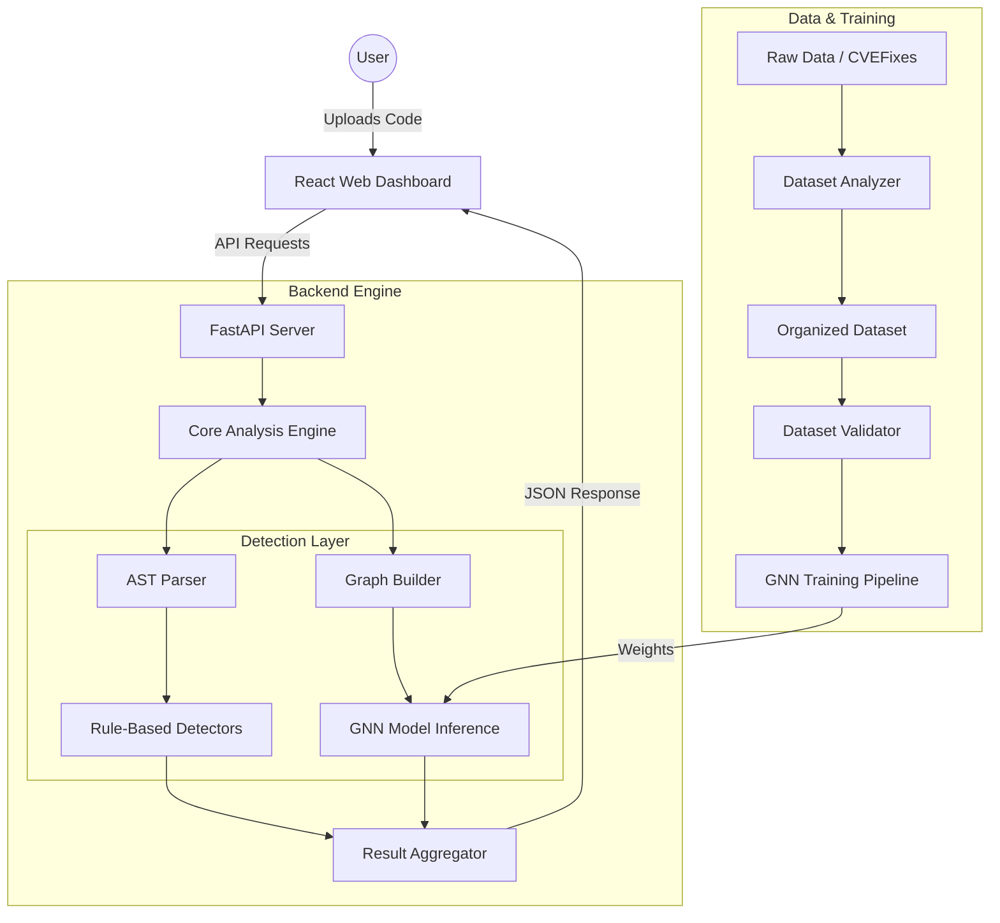

# System Architecture: Python Vulnerability Detector

The system is a hybrid vulnerability detection platform that combines **Static Analysis (AST Parsing)**, **GNN-based Deep Learning**, and **Rule-based Heuristics**.

---

## High-Level Overview

---

## 🔧 Core Components

### 1. Frontend (React + Vite)
- **Dashboard**: Central UI for managing scans and viewing results.
- **Code Editor**: Monaco-based editor with line-level vulnerability highlighting.
- **Results Panel**: Interactive breakdown of detected vulnerabilities (Severity, Remediation, Type).
- **Dataset Management**: UI for uploading raw files and triggering classification/training.

### 2. Backend (FastAPI)
- **REST API**: Endpoints for scanning code, managing datasets, and controlling model training.
- **Core Engine**:
    - **AST Parser**: Converts Python source code into structured Abstract Syntax Tree (AST) nodes with enriched metadata (labels, line mapping).
    - **Graph Builder**: Transforms the AST into an Abstract Syntax Graph (ASG) suitable for Graph Neural Networks.
    - **Inference Engine**: Executes all detectors (rule-based and ML) and aggregates results with confidence scores.

### 3. Detection Layer
- **Rule-Based Detectors**: Fast, precise pattern matching using AST traversal (SQLi, XXE, Cryptography, etc.).
- **GNN Model**: A Graph Convolutional Network (GCN) that analyzes the code's structure to find complex bugs that rules might miss.
- **Taint Analyzer**: Tracks data flow from inputs (sources) to dangerous sinks (e.g., `eval()`).

### 4. Training Pipeline
- **Dataset Analyzer**: Auto-classifies raw folders or CSVs (like `CVEFixes.csv`) into training-ready categories.
- **Dataset Validator**: Ensures class balance, syntax validity, and deduplication before training starts.
- **Trainer**: Handles the Pytorch/GNN training loop, evaluating F1 scores and saving the best model state.

---

## 🛠️ Technical Stack

| Category | Technology |
|----------|------------|
| **Frontend** | React, Vite, Tailwind CSS, Monaco Editor |
| **Backend** | Python, FastAPI, Uvicorn |
| **Deep Learning** | PyTorch, PyTorch Geometric (GNN) |
| **Static Analysis** | `ast` (Python StdLib), `astunparse` |
| **Dataset** | CSV (CVEFixes), Raw Python snippets |

---

## 🔄 Scan Data Flow
1. **Input**: User pastes or uploads Python code.
2. **Analysis**:
    - `ASTParser` generates node list.
    - `LogicFlawDetector` & others run rule checks.
    - `GraphBuilder` creates topological map.
    - `VulnerabilityGNN` predicts nodes with embeddings.
3. **Aggregation**: `ResultAggregator` merges overlaps and removes false positives (via Sanitizer Detector).
4. **Output**: Detailed JSON report sent to UI.
